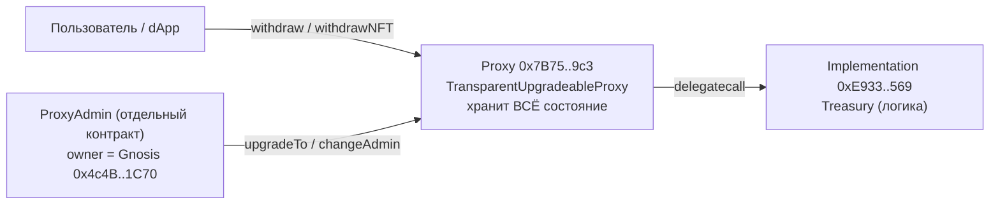

# Cheelee Treasury

Hardhat-проект для смарт-контракта **Treasury** проекта Cheelee, развёрнутого на BNB Smart Chain под `TransparentUpgradeableProxy` от OpenZeppelin.

`Treasury` — это вольт-хранилище ERC20 / ERC721, выдающее активы по EIP-712 подписи доверенного `signer` с дневными лимитами на пользователя и опцию (token / NFT). Списание возможно только тем, на кого подписана payload, при условии, что подпись не использовалась ранее и не истекла.

## Адреса в BSC mainnet (chainId 56)

| Роль | Адрес | BscScan |
| --- | --- | --- |
| Proxy (точка входа для пользователей) | `0x7B755581DE713B6e4CFf7B9C62F56b57bcE7a9c3` | [bscscan](https://bscscan.com/address/0x7B755581DE713B6e4CFf7B9C62F56b57bcE7a9c3#code) |
| Implementation (логика `Treasury`) | `0xE93310F7ef7bd4DB7EEec110a340DF79D253f569` | [bscscan](https://bscscan.com/address/0xe93310f7ef7bd4db7eeec110a340df79d253f569#code) |
| Owner (Gnosis Safe, hardcoded в `initialize`) | `0x4c4B657574782E68ECEdabA8151e25dC2C9C1C70` | [bscscan](https://bscscan.com/address/0x4c4B657574782E68ECEdabA8151e25dC2C9C1C70) |

## Как работает связка прокси / имплементация



- Состояние (`tokens`, `nfts`, `signer`, `tokensTransfersPerDay`, `nftTransfersPerDay`, `usedSignature` и т.д.) лежит в storage прокси `0x7B75..9c3`. На имплементации `0xE933..569` `initialize` вызывать нельзя — её конструктор делает `_disableInitializers()`. `initialize(...)` отрабатывает один раз через прокси сразу после деплоя.
- `Treasury.transferOwnership(GNOSIS)` в `initialize` делает Gnosis-сейф владельцем самого Treasury (через прокси). Владельцем `ProxyAdmin` тоже должен стать Gnosis — это отдельный шаг после деплоя (`ProxyAdmin.transferOwnership(GNOSIS)` от деплоера).
- Исходники `TransparentUpgradeableProxy.sol` / `ProxyAdmin.sol` в репозиторий не копируются — они приходят из npm-пакета `@openzeppelin/contracts` через плагин [`@openzeppelin/hardhat-upgrades`](https://docs.openzeppelin.com/upgrades-plugins/1.x/api-hardhat-upgrades).

## Параметры компиляции

Совпадают с верифицированным on-chain байткодом:

- Solidity `0.8.17` (`v0.8.17+commit.8df45f5f`)
- Optimizer **выключен**, `runs = 200`
- EVM version: default

## Зависимости

- `@openzeppelin/contracts-upgradeable@4.7.3` — пин на ту же мажор/минорную линию, что использовалась при оригинальной верификации (максимум на цепочке — `ECDSAUpgradeable` v4.7.3).
- `@openzeppelin/contracts@^4.9.6` — нужен плагину `hardhat-upgrades` для развёртывания `TransparentUpgradeableProxy` и `ProxyAdmin`.
- `@openzeppelin/hardhat-upgrades@^3` + `@nomicfoundation/hardhat-toolbox@^4` + `hardhat@^2.22`.

## Установка и сборка

```bash
cd cheelee
npm install
npx hardhat compile
```

Артефакт появится по пути `artifacts/contracts/Treasury.sol/Treasury.json`.

## Деплой

1. Скопировать `.env.example` в `.env` и проставить `PRIVATE_KEY`, RPC и адреса аргументов `initialize` (`CASES`, `GLASSES`, `SIGNER`, `LEE`, `CHEEL`, `USDT`).
2. Запустить:

   ```bash
   npm run deploy:bscTestnet   # сначала на тестнет
   npm run deploy:bsc          # потом на mainnet
   ```

   Скрипт `scripts/deploy.js` через `upgrades.deployProxy(...)` выполняет три действия одной командой:

   1. Деплоит имплементацию `Treasury`.
   2. Деплоит `ProxyAdmin` (если ещё нет в манифесте `.openzeppelin/`).
   3. Деплоит `TransparentUpgradeableProxy(impl, admin, initData)`, где `initData = Treasury.interface.encodeFunctionData("initialize", [...])`.

3. После успешного деплоя вывод покажет адреса `proxy`, `implementation`, `proxyAdmin`. Передайте `ProxyAdmin.transferOwnership` в Gnosis Safe (`0x4c4B..1C70`).

## Структура

```
cheelee/
├── .env.example
├── README.md
├── package.json
├── hardhat.config.js
├── contracts/
│   ├── Treasury.sol
│   └── interfaces/
│       └── CustomNFT.sol
└── scripts/
    └── deploy.js
```
