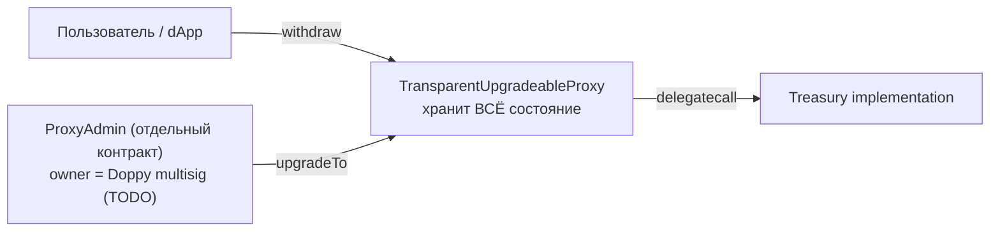

# Doppy Treasury

Hardhat-проект для смарт-контракта **Treasury** проекта Doppy. Это **ERC20-only форк** Cheelee Treasury: вся NFT-функциональность (поля `cases`/`glasses`, `withdrawNFT`, типхеш `NFT_PASS_TYPEHASH`, наследование `ERC721HolderUpgradeable`, интерфейс `CustomNFT`) **намеренно удалена** — Doppy NFT не использует и не планирует.

- ERC20: **DOPPY**, **BNH**, **USDT** (вместо `LEE`/`CHEEL`/`USDT` у Cheelee).
- NFT: **отсутствуют**.
- Дневные лимиты: **10 / 10 / 10** в 1e18 на каждый ERC20 (у Cheelee было 200 / 100 / 2000).

`Treasury` — это вольт-хранилище ERC20, выдающее токены по EIP-712 подписи доверенного `signer` с дневными лимитами на пользователя и опцию (token-индекс). Развёртывается под `TransparentUpgradeableProxy` от OpenZeppelin.

## Diff vs cheelee

Чтобы локально воспроизвести сравнение с Cheelee Treasury, из корня репозитория:

```bash
diff -u cheelee/contracts/Treasury.sol doppy/contracts/Treasury.sol
diff -ruN cheelee/contracts/interfaces/ doppy/contracts/interfaces/
```

### Высокоуровнево

В отличие от Cheelee, в Doppy:

1. **Удалены NFT-импорты и наследование** — `ERC721HolderUpgradeable`, `./interfaces/CustomNFT.sol`. Контракт больше не умеет принимать ERC721.
2. **Удалены NFT-события** — `WithdrawedNFT`, `SetNftLimit`, `AddNFT`, `DisableNFT`.
3. **Удалён NFT-типхеш** — `NFT_PASS_TYPEHASH`. ERC20-типхеш `PASS_TYPEHASH` остался **байт-в-байт** идентичным cheelee, бэкенд-подписант ERC20-вывода без изменений.
4. **Удалены NFT-поля состояния** — `nftTransfersPerDay`, `maxNftTransfersPerDay`, `nfts`. Storage layout у doppy и cheelee теперь **разный** (см. ниже).
5. **`initialize` сократился** до 4 параметров — `(address _signer, IERC20 _doppy, IERC20 _bnh, IERC20 _usdt)`. Параметров `_cases`/`_glasses` больше нет.
6. **Удалены NFT-функции** — `verifySignatureNFT`, `withdrawNFT`, `setNftLimit`, `addNFT`, `disableNFT`.
7. **Переименованы ERC20-параметры** — `_lee` → `_doppy`, `_cheel` → `_bnh`. `_usdt` остался.
8. **Изменены дневные лимиты** — все три по `10 * 10**18` (вместо `200 / 100 / 2000` у Cheelee).
9. **`GNOSIS` — заглушка-предохранитель** — `address(0)` + TODO-комментарий вместо хардкода Cheelee multisig.

### Полный текст diff'а

```diff
--- cheelee/contracts/Treasury.sol
+++ doppy/contracts/Treasury.sol
@@ -6,15 +6,11 @@
 import "@openzeppelin/contracts-upgradeable/access/OwnableUpgradeable.sol";
 import "@openzeppelin/contracts-upgradeable/token/ERC20/IERC20Upgradeable.sol";
 import "@openzeppelin/contracts-upgradeable/token/ERC20/utils/SafeERC20Upgradeable.sol";
-import "@openzeppelin/contracts-upgradeable/token/ERC721/utils/ERC721HolderUpgradeable.sol";

-import "./interfaces/CustomNFT.sol";
-
 /// @title Treasury
 /// @title Smart contract used to transfer tokens from inner to outter wallet
 contract Treasury is
     EIP712Upgradeable,
-    ERC721HolderUpgradeable,
     OwnableUpgradeable
 {
     event Withdrawed(
@@ -22,27 +18,15 @@
         uint256 amount,
         uint256 indexed option
     );
-    event WithdrawedNFT(
-        address indexed user,
-        uint256 id,
-        uint256 indexed option
-    );
     event SetSigner(address signer);
     event SetTokenLimit(uint256 index, uint256 newLimit);
-    event SetNftLimit(uint256 index, uint256 newLimit);
     event AddToken(address addr, uint256 limit);
-    event AddNFT(address addr, uint256 limit);
     event DisableToken(uint256 index);
-    event DisableNFT(uint256 index);
     event WithdrawToken(address token, uint256 amount);

     string public constant NAME = "TREASURY";
     string public constant EIP712_VERSION = "1";

-    bytes32 public constant NFT_PASS_TYPEHASH =
-        keccak256(
-            "WithdrawNFTSignature(uint256 nonce,uint256 id,address address_to,uint256 ttl,uint256 option)"
-        );
     bytes32 public constant PASS_TYPEHASH =
         keccak256(
             "WithdrawSignature(uint256 nonce,uint256 amount,address address_to,uint256 ttl,uint256 option)"
@@ -53,15 +37,15 @@
     //who              //when             //option   //amount
     mapping(address => mapping(uint256 => mapping(uint256 => uint256)))
         public tokensTransfersPerDay;
-    mapping(address => mapping(uint256 => mapping(uint256 => uint256)))
-        public nftTransfersPerDay;
-    uint256[] public maxNftTransfersPerDay;
     uint256[] public maxTokenTransferPerDay;

     address public signer;
-    address public constant GNOSIS = 0x4c4B657574782E68ECEdabA8151e25dC2C9C1C70;
+    // TODO(doppy): replace with the actual Doppy multisig address before deploying.
+    // While GNOSIS == address(0), `transferOwnership(GNOSIS)` inside `initialize`
+    // reverts with "Ownable: new owner is the zero address", so an accidental
+    // mainnet/testnet deploy is impossible until the address is set.
+    address public constant GNOSIS = address(0);
     IERC20Upgradeable[] public tokens;
-    CustomNFT[] public nfts;
     uint256[50] __gap;

     /// @custom:oz-upgrades-unsafe-allow constructor
@@ -70,34 +54,25 @@
     }
     
     function initialize(
-        CustomNFT _cases,
-        CustomNFT _glasses,
         address _signer,
-        IERC20Upgradeable _lee,
-        IERC20Upgradeable _cheel,
+        IERC20Upgradeable _doppy,
+        IERC20Upgradeable _bnh,
         IERC20Upgradeable _usdt
     ) external initializer {
         __Ownable_init();

-        require(address(_cases) != address(0), "Can't set zero address");
-        require(address(_glasses) != address(0), "Can't set zero address");
-        require(address(_lee) != address(0), "Can't set zero address");
-        require(address(_cheel) != address(0), "Can't set zero address");
+        require(address(_doppy) != address(0), "Can't set zero address");
+        require(address(_bnh) != address(0), "Can't set zero address");
         require(address(_usdt) != address(0), "Can't set zero address");

         __EIP712_init(NAME, EIP712_VERSION);

-        nfts.push(_cases);
-        nfts.push(_glasses);
-        maxNftTransfersPerDay.push(5);
-        maxNftTransfersPerDay.push(5);
-
-        tokens.push(_lee);
-        tokens.push(_cheel);
+        tokens.push(_doppy);
+        tokens.push(_bnh);
         tokens.push(_usdt);
-        maxTokenTransferPerDay.push(200 * 10**18);
-        maxTokenTransferPerDay.push(100 * 10**18);
-        maxTokenTransferPerDay.push(2000 * 10**18);
+        maxTokenTransferPerDay.push(10 * 10**18);
+        maxTokenTransferPerDay.push(10 * 10**18);
+        maxTokenTransferPerDay.push(10 * 10**18);

         signer = _signer;

@@ -121,23 +96,6 @@
         return ECDSAUpgradeable.recover(_digest, _signature);
     }

-    /// @notice Used to verify NFT withdrawal signature
-    function verifySignatureNFT(
-        uint256 _nonce,
-        uint256 _id,
-        address _to,
-        uint256 _ttl,
-        uint256 _option,
-        bytes memory _signature
-    ) public view virtual returns (address) {
-        bytes32 _digest = _hashTypedDataV4(
-            keccak256(
-                abi.encode(NFT_PASS_TYPEHASH, _nonce, _id, _to, _ttl, _option)
-            )
-        );
-        return ECDSAUpgradeable.recover(_digest, _signature);
-    }
-
     /// @notice Withdraw erc20 using signature
     function withdraw(
         uint256 _nonce,
@@ -170,38 +128,6 @@
         emit Withdrawed(_to, _amount, _option);
     }

-    /// @notice Withdraw NFT using signature
-    function withdrawNFT(
-        uint256 _nonce,
-        uint256 _id,
-        address _to,
-        uint256 _ttl,
-        uint256 _option,
-        bytes memory _signature
-    ) external virtual {
-        require(address(nfts[_option]) != address(0), "Option disabled");
-        uint256 currentDay = getCurrentDay();
-        require(
-            nftTransfersPerDay[_to][currentDay][_option] <
-                maxNftTransfersPerDay[_option],
-            "Too many transfers"
-        );
-        nftTransfersPerDay[_to][currentDay][_option]++;
-
-        require(_ttl >= block.timestamp, "Signature is no longer active");
-        require(
-            verifySignatureNFT(_nonce, _id, _to, _ttl, _option, _signature) ==
-                signer,
-            "Bad Signature"
-        );
-        require(!usedSignature[_nonce], "Signature already used");
-
-        usedSignature[_nonce] = true;
-        nfts[_option].receiveNFT(_to, _id);
-
-        emit WithdrawedNFT(_to, _id, _option);
-    }
-
     /// @notice Function returns current day in format:
     /// 1 - monday
     /// 2 - tuesday
@@ -227,13 +153,6 @@
         emit SetTokenLimit(_index, _newLimit);
     }

-    /// @notice Set limit for NFT withdrawals
-    function setNftLimit(uint256 _index, uint256 _newLimit) external onlyOwner {
-        maxNftTransfersPerDay[_index] = _newLimit;
-
-        emit SetNftLimit(_index, _newLimit);
-    }
-
     /// @notice Add support for new erc20 token
     function addToken(IERC20Upgradeable _addr, uint256 _limit)
         external
@@ -246,15 +165,6 @@
         emit AddToken(address(_addr), _limit);
     }

-    /// @notice Add support for new NFT
-    function addNFT(CustomNFT _addr, uint256 _limit) external onlyOwner {
-        require(address(_addr) != address(0), "Zero address not acceptable");
-        nfts.push(_addr);
-        maxNftTransfersPerDay.push(_limit);
-
-        emit AddNFT(address(_addr), _limit);
-    }
-
     /// @notice Disable erc20 token by index
     function disableToken(uint256 _index) external onlyOwner {
         tokens[_index] = IERC20Upgradeable(address(0));
@@ -262,13 +172,6 @@
         emit DisableToken(_index);
     }

-    /// @notice Disable nft by index
-    function disableNFT(uint256 _index) external onlyOwner {
-        nfts[_index] = CustomNFT(address(0));
-
-        emit DisableNFT(_index);
-    }
-
     /// @notice Withdraw tokens for owner
     function withdrawToken(IERC20Upgradeable _token, uint256 _amount)
         external
```

### `contracts/interfaces/`

В Cheelee лежит `CustomNFT.sol` (интерфейс ERC721 c доп. методом `receiveNFT`). В Doppy папка `interfaces/` **отсутствует целиком** — её содержимое стало не нужно.

```diff
- cheelee/contracts/interfaces/CustomNFT.sol
+ (нет)
```

### Что **не** меняется

- `PASS_TYPEHASH` (ERC20) — формат подписи и порядок полей идентичны Cheelee. Backend, который сейчас подписывает `WithdrawSignature(...)` для Cheelee, может использовать тот же код для Doppy без изменений (только сменить `verifyingContract` на адрес Doppy-прокси).
- Domain EIP-712: `NAME = "TREASURY"`, `EIP712_VERSION = "1"` — идентичны. Коллизий подписей между cheelee и doppy не будет, потому что `verifyingContract` (адрес прокси) разный.
- `verifySignature` (ERC20), `withdraw` (ERC20), `getCurrentDay`, `setSigner`, `setTokenLimit`, `addToken`, `disableToken`, `withdrawToken`, `__gap[50]` — байт-в-байт.
- Параметры компиляции (Solidity 0.8.17, optimizer off) — те же.

### Storage layout

Storage layout у doppy и cheelee **разный** (поля `nftTransfersPerDay`, `maxNftTransfersPerDay`, `nfts` удалены). Это значит:

- **Нельзя** взять Doppy-имплементацию и сделать ею upgrade Cheelee-прокси (или наоборот) — `@openzeppelin/hardhat-upgrades` отклонит апгрейд с ошибкой про несовместимость layout. Это намеренно — Doppy и Cheelee Treasury теперь два независимых контракта.
- Для самого Doppy storage layout фиксируется этим релизом. Дальнейшие апгрейды Doppy-имплементации должны соблюдать его (новые поля только в конец, поверх `__gap`).

## TODO перед первым деплоем

> **Не подставлен адрес владельца Doppy multisig.**
>
> В [contracts/Treasury.sol](contracts/Treasury.sol) константа `GNOSIS` сейчас равна `address(0)`:
>
> ```solidity
> // TODO(doppy): replace with the actual Doppy multisig address before deploying.
> address public constant GNOSIS = address(0);
> ```
>
> Любой деплой с этим значением **гарантированно упадёт** в `initialize` с ошибкой `Ownable: new owner is the zero address`. Это сделано намеренно — предохранитель от случайного выкатывания контракта без владельца. Перед mainnet/testnet деплоем замените на реальный адрес мультисига Doppy и пересоберите.

## Адреса в BSC

Контракт пока не развёрнут на mainnet. После первого деплоя адреса прокси / имплементации / `ProxyAdmin` запишутся сюда.

> Если на BSC testnet ранее проводился smoke-deploy предыдущей версии Doppy Treasury (с NFT-логикой) — тот прокси **storage-несовместим** с текущим контрактом, его следует считать deprecated. Новый деплой `npm run deploy:bscTestnet` поднимет свежий прокси.

## Как это работает (вкратце)



Состояние (`tokens`, `signer`, `tokensTransfersPerDay`, `usedSignature`, балансы) лежит в storage прокси. Имплементация хранит только bytecode. `initialize(...)` вызывается один раз через прокси сразу после деплоя; затем `transferOwnership(GNOSIS)` передаёт владение мультисигу.

Подробное объяснение паттерна, дневных лимитов и storage-инвариантов — в README соседнего подпроекта [`../cheelee/README.md`](../cheelee/README.md). Для Doppy всё то же самое за вычетом NFT.

## Параметры компиляции

Совпадают с Cheelee Treasury:

- Solidity `0.8.17`
- Optimizer **выключен**, `runs = 200`
- EVM version: default

## Зависимости

- `@openzeppelin/contracts-upgradeable@4.7.3` — пин на ту же линию OZ, что использует Cheelee Treasury (для совместимости импортов).
- `@openzeppelin/contracts@^4.9.6` — нужен плагину `hardhat-upgrades` для развёртывания `TransparentUpgradeableProxy` и `ProxyAdmin`.
- `@openzeppelin/hardhat-upgrades@^3` + `@nomicfoundation/hardhat-toolbox@^4` + `hardhat@^2.22`.

## Установка и сборка

```bash
cd doppy
npm install
npx hardhat compile
```

Артефакт появится по пути `artifacts/contracts/Treasury.sol/Treasury.json`.

## Деплой

1. **Сначала** — установить `GNOSIS` в `contracts/Treasury.sol` на адрес Doppy multisig (см. блок TODO выше).
2. Скопировать `.env.example` в `.env`, заполнить:
   - `PRIVATE_KEY` — деплоер с tBNB / BNB на балансе.
   - `BSC_TESTNET_RPC_URL` / `BSC_RPC_URL` — опционально, иначе используется публичная нода из `hardhat.config.js`.
   - `BSCSCAN_API_KEY` — опционально, нужен только для `hardhat verify`.
   - `SIGNER` — EOA-адрес бэкенда, который подписывает `WithdrawSignature` payload'ы.
   - `DOPPY`, `BNH`, `USDT` — **прокси-адреса** ERC20-токенов. На BSC mainnet `USDT = 0x55d398326f99059fF775485246999027B3197955` (Tether-BEP20, не апгрейдабл).
3. Запустить:

   ```bash
   npm run deploy:bscTestnet   # сначала на тестнет
   npm run deploy:bsc          # потом на mainnet
   ```

   Скрипт `scripts/deploy.js` через `upgrades.deployProxy(...)` за один вызов поднимает Treasury implementation + ProxyAdmin + TransparentUpgradeableProxy и инициализирует прокси.

4. После успешного деплоя в выводе появятся адреса `proxy`, `implementation`, `proxyAdmin`. Передайте `ProxyAdmin.transferOwnership` в Doppy multisig.

## Структура

```
doppy/
├── .env.example
├── README.md
├── package.json
├── hardhat.config.js
├── contracts/
│   └── Treasury.sol
└── scripts/
    └── deploy.js
```
