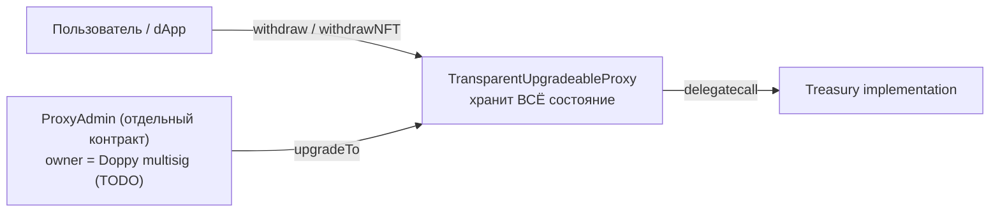

# Doppy Treasury

Hardhat-проект для смарт-контракта **Treasury** проекта Doppy. Структурно — копия `cheelee/`, отличия только в наборе токенов и адресе владельца:

- ERC20: **DOPPY**, **BNH**, **USDT** (вместо `LEE`/`CHEEL`/`USDT` у Cheelee).
- NFT: те же `cases` и `glasses` (имена параметров `initialize` не меняются).
- Дневные лимиты: **200 / 100 / 2000** в 1e18 для токенов, **5 + 5** для NFT — те же, что у Cheelee.

`Treasury` — это вольт-хранилище ERC20 / ERC721, выдающее активы по EIP-712 подписи доверенного `signer` с дневными лимитами на пользователя и опцию (token / NFT). Развёртывается под `TransparentUpgradeableProxy` от OpenZeppelin.

## TODO перед первым деплоем

> **Не подставлен адрес владельца Doppy multisig.**
>
> В [contracts/Treasury.sol](contracts/Treasury.sol) константа `GNOSIS` сейчас равна `address(0)`:
>
> ```solidity
> // TODO(doppy): replace with the actual Doppy multisig address before deploying.
> address public constant GNOSIS = address(0);
> ```
>
> Любой деплой с этим значением **гарантированно упадёт** в `initialize` с ошибкой `Ownable: new owner is the zero address`. Это сделано намеренно — предохранитель от случайного выкатывания контракта без владельца. Перед mainnet/testnet деплоем замените на реальный адрес мультисига Doppy и пересоберите.

## Адреса в BSC

Контракт пока не развёрнут. После первого деплоя адреса прокси / имплементации / `ProxyAdmin` запишутся сюда.

## Как это работает (вкратце)



Состояние (`tokens`, `nfts`, `signer`, `tokensTransfersPerDay`, `usedSignature`, балансы) лежит в storage прокси. Имплементация хранит только bytecode. `initialize(...)` вызывается один раз через прокси сразу после деплоя; затем `transferOwnership(GNOSIS)` передаёт владение мультисигу.

Подробное объяснение паттерна, дневных лимитов и storage-инвариантов — в README соседнего подпроекта [`../cheelee/README.md`](../cheelee/README.md). Для Doppy всё то же самое, отличается только набор токенов и адрес владельца.

## Параметры компиляции

Совпадают с Cheelee Treasury:

- Solidity `0.8.17`
- Optimizer **выключен**, `runs = 200`
- EVM version: default

## Зависимости

- `@openzeppelin/contracts-upgradeable@4.7.3` — пин на ту же линию OZ, что использует Cheelee Treasury (для совместимости импортов).
- `@openzeppelin/contracts@^4.9.6` — нужен плагину `hardhat-upgrades` для развёртывания `TransparentUpgradeableProxy` и `ProxyAdmin`.
- `@openzeppelin/hardhat-upgrades@^3` + `@nomicfoundation/hardhat-toolbox@^4` + `hardhat@^2.22`.

## Установка и сборка

```bash
cd doppy
npm install
npx hardhat compile
```

Артефакт появится по пути `artifacts/contracts/Treasury.sol/Treasury.json`.

## Деплой

1. **Сначала** — установить `GNOSIS` в `contracts/Treasury.sol` на адрес Doppy multisig (см. блок TODO выше).
2. Скопировать `.env.example` в `.env`, заполнить `PRIVATE_KEY`, RPC и адреса аргументов `initialize` (`CASES`, `GLASSES`, `SIGNER`, `DOPPY`, `BNH`, `USDT`).
3. Запустить:

   ```bash
   npm run deploy:bscTestnet   # сначала на тестнет
   npm run deploy:bsc          # потом на mainnet
   ```

   Скрипт `scripts/deploy.js` через `upgrades.deployProxy(...)` за один вызов поднимает Treasury implementation + ProxyAdmin + TransparentUpgradeableProxy и инициализирует прокси.

4. После успешного деплоя в выводе появятся адреса `proxy`, `implementation`, `proxyAdmin`. Передайте `ProxyAdmin.transferOwnership` в Doppy multisig.

## Структура

```
doppy/
├── .env.example
├── README.md
├── package.json
├── hardhat.config.js
├── contracts/
│   ├── Treasury.sol
│   └── interfaces/
│       └── CustomNFT.sol
└── scripts/
    └── deploy.js
```
