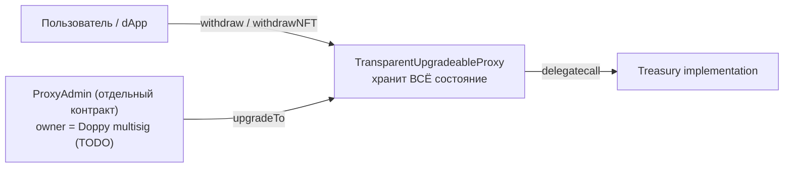

# Doppy Treasury

Hardhat-проект для смарт-контракта **Treasury** проекта Doppy. Структурно — копия `cheelee/`, отличия только в наборе токенов и адресе владельца:

- ERC20: **DOPPY**, **BNH**, **USDT** (вместо `LEE`/`CHEEL`/`USDT` у Cheelee).
- NFT: те же `cases` и `glasses` (имена параметров `initialize` не меняются).
- Дневные лимиты: **10 / 10 / 10** в 1e18 на каждый ERC20 (у Cheelee было 200 / 100 / 2000) и **5 + 5** для NFT (как у Cheelee).

`Treasury` — это вольт-хранилище ERC20 / ERC721, выдающее активы по EIP-712 подписи доверенного `signer` с дневными лимитами на пользователя и опцию (token / NFT). Развёртывается под `TransparentUpgradeableProxy` от OpenZeppelin.

## Diff vs cheelee

Чтобы локально воспроизвести сравнение с Cheelee Treasury, из корня репозитория:

```bash
diff -u cheelee/contracts/Treasury.sol doppy/contracts/Treasury.sol
diff -u cheelee/contracts/interfaces/CustomNFT.sol doppy/contracts/interfaces/CustomNFT.sol
```

Актуальный вывод:

### `contracts/Treasury.sol`

```diff
--- cheelee/contracts/Treasury.sol
+++ doppy/contracts/Treasury.sol
@@ -59,7 +59,11 @@
     uint256[] public maxTokenTransferPerDay;
 
     address public signer;
-    address public constant GNOSIS = 0x4c4B657574782E68ECEdabA8151e25dC2C9C1C70;
+    // TODO(doppy): replace with the actual Doppy multisig address before deploying.
+    // While GNOSIS == address(0), `transferOwnership(GNOSIS)` inside `initialize`
+    // reverts with "Ownable: new owner is the zero address", so an accidental
+    // mainnet/testnet deploy is impossible until the address is set.
+    address public constant GNOSIS = address(0);
     IERC20Upgradeable[] public tokens;
     CustomNFT[] public nfts;
     uint256[50] __gap;
@@ -73,16 +77,16 @@
         CustomNFT _cases,
         CustomNFT _glasses,
         address _signer,
-        IERC20Upgradeable _lee,
-        IERC20Upgradeable _cheel,
+        IERC20Upgradeable _doppy,
+        IERC20Upgradeable _bnh,
         IERC20Upgradeable _usdt
     ) external initializer {
         __Ownable_init();
 
         require(address(_cases) != address(0), "Can't set zero address");
         require(address(_glasses) != address(0), "Can't set zero address");
-        require(address(_lee) != address(0), "Can't set zero address");
-        require(address(_cheel) != address(0), "Can't set zero address");
+        require(address(_doppy) != address(0), "Can't set zero address");
+        require(address(_bnh) != address(0), "Can't set zero address");
         require(address(_usdt) != address(0), "Can't set zero address");
 
         __EIP712_init(NAME, EIP712_VERSION);
@@ -92,12 +96,12 @@
         maxNftTransfersPerDay.push(5);
         maxNftTransfersPerDay.push(5);
 
-        tokens.push(_lee);
-        tokens.push(_cheel);
+        tokens.push(_doppy);
+        tokens.push(_bnh);
         tokens.push(_usdt);
-        maxTokenTransferPerDay.push(200 * 10**18);
-        maxTokenTransferPerDay.push(100 * 10**18);
-        maxTokenTransferPerDay.push(2000 * 10**18);
+        maxTokenTransferPerDay.push(10 * 10**18);
+        maxTokenTransferPerDay.push(10 * 10**18);
+        maxTokenTransferPerDay.push(10 * 10**18);
 
         signer = _signer;
 
```

Что в этом diff'е и почему:

- **Хунк 1 (`GNOSIS`)** — единственное небезопасное-без-правки место. В Cheelee это hardcoded адрес мультисига `0x4c4B…1C70`, который `transferOwnership(GNOSIS)` в `initialize` ставит владельцем. В Doppy на это место поставлен `address(0)` + TODO-комментарий: пока константа нулевая, OpenZeppelin'овский `Ownable.transferOwnership` в самом конце `initialize` ревертит с `Ownable: new owner is the zero address`, и contract не может быть инициализирован. Это намеренный предохранитель, а не баг — он гарантирует, что без подстановки реального адреса мультисига Doppy ни один деплой не пройдёт.
- **Хунк 2 (параметры `initialize`)** — переименование двух параметров и соответствующих `require` / `tokens.push`: `_lee` → `_doppy`, `_cheel` → `_bnh`. Третий ERC20 (`_usdt`) и оба NFT (`_cases`, `_glasses`) остаются с теми же именами и в том же порядке.
- **Хунк 3 (`tokens.push` + дневные лимиты)** — две правки в одном блоке:
  - **Переименование `tokens.push`** — продолжение хунка 2. Порядок индексов в массиве `tokens` сохраняется: `[0] = doppy`, `[1] = bnh`, `[2] = usdt`. Это важно для подписи: off-chain `signer` должен подписывать `option` именно с этими индексами.
  - **Новые дневные лимиты — `10 * 10**18` для всех трёх токенов** (вместо `200 / 100 / 2000` у Cheelee). Лимит per-recipient per-day per-token, проверка живёт в [`withdraw`](contracts/Treasury.sol) (`tokensTransfersPerDay[_to][currentDay][_option] + _amount <= maxTokenTransferPerDay[_option]`). После деплоя владелец Doppy multisig может скорректировать лимиты налету через `setTokenLimit(index, newLimit)` без апгрейда контракта — изменения в исходнике в `initialize` влияют только на самый первый запуск.

Что **НЕ** меняется и поэтому в diff'е отсутствует:
- Все события (`Withdrawed`, `WithdrawedNFT`, `SetSigner`, …).
- `NAME = "TREASURY"`, `EIP712_VERSION = "1"` — домен EIP-712 идентичен; коллизий подписей между cheelee и doppy всё равно нет, потому что `verifyingContract` (адрес прокси) разный.
- `PASS_TYPEHASH`, `NFT_PASS_TYPEHASH` — формат подписи и порядок полей одинаковые.
- Маппинги (`tokensTransfersPerDay`, `nftTransfersPerDay`, `usedSignature`), массивы лимитов, `__gap[50]` — раскладка storage идентична. Это важно: если в будущем Cheelee и Doppy решат шерить одну и ту же реализацию через апгрейд ProxyAdmin'ом — storage layout совпадает.
- `verifySignature*`, `withdraw`, `withdrawNFT`, `getCurrentDay`, `setSigner`, `setTokenLimit`, `setNftLimit`, `addToken`, `addNFT`, `disableToken`, `disableNFT`, `withdrawToken` — **байт-в-байт** копия из cheelee.

### `contracts/interfaces/CustomNFT.sol`

Команда `diff` ничего не выводит — файлы полностью идентичны.

## TODO перед первым деплоем

> **Не подставлен адрес владельца Doppy multisig.**
>
> В [contracts/Treasury.sol](contracts/Treasury.sol) константа `GNOSIS` сейчас равна `address(0)`:
>
> ```solidity
> // TODO(doppy): replace with the actual Doppy multisig address before deploying.
> address public constant GNOSIS = address(0);
> ```
>
> Любой деплой с этим значением **гарантированно упадёт** в `initialize` с ошибкой `Ownable: new owner is the zero address`. Это сделано намеренно — предохранитель от случайного выкатывания контракта без владельца. Перед mainnet/testnet деплоем замените на реальный адрес мультисига Doppy и пересоберите.

## Адреса в BSC

Контракт пока не развёрнут. После первого деплоя адреса прокси / имплементации / `ProxyAdmin` запишутся сюда.

## Как это работает (вкратце)



Состояние (`tokens`, `nfts`, `signer`, `tokensTransfersPerDay`, `usedSignature`, балансы) лежит в storage прокси. Имплементация хранит только bytecode. `initialize(...)` вызывается один раз через прокси сразу после деплоя; затем `transferOwnership(GNOSIS)` передаёт владение мультисигу.

Подробное объяснение паттерна, дневных лимитов и storage-инвариантов — в README соседнего подпроекта [`../cheelee/README.md`](../cheelee/README.md). Для Doppy всё то же самое, отличается только набор токенов и адрес владельца.

## Параметры компиляции

Совпадают с Cheelee Treasury:

- Solidity `0.8.17`
- Optimizer **выключен**, `runs = 200`
- EVM version: default

## Зависимости

- `@openzeppelin/contracts-upgradeable@4.7.3` — пин на ту же линию OZ, что использует Cheelee Treasury (для совместимости импортов).
- `@openzeppelin/contracts@^4.9.6` — нужен плагину `hardhat-upgrades` для развёртывания `TransparentUpgradeableProxy` и `ProxyAdmin`.
- `@openzeppelin/hardhat-upgrades@^3` + `@nomicfoundation/hardhat-toolbox@^4` + `hardhat@^2.22`.

## Установка и сборка

```bash
cd doppy
npm install
npx hardhat compile
```

Артефакт появится по пути `artifacts/contracts/Treasury.sol/Treasury.json`.

## Деплой

1. **Сначала** — установить `GNOSIS` в `contracts/Treasury.sol` на адрес Doppy multisig (см. блок TODO выше).
2. Скопировать `.env.example` в `.env`, заполнить `PRIVATE_KEY`, RPC и адреса аргументов `initialize` (`CASES`, `GLASSES`, `SIGNER`, `DOPPY`, `BNH`, `USDT`).
3. Запустить:

   ```bash
   npm run deploy:bscTestnet   # сначала на тестнет
   npm run deploy:bsc          # потом на mainnet
   ```

   Скрипт `scripts/deploy.js` через `upgrades.deployProxy(...)` за один вызов поднимает Treasury implementation + ProxyAdmin + TransparentUpgradeableProxy и инициализирует прокси.

4. После успешного деплоя в выводе появятся адреса `proxy`, `implementation`, `proxyAdmin`. Передайте `ProxyAdmin.transferOwnership` в Doppy multisig.

## Структура

```
doppy/
├── .env.example
├── README.md
├── package.json
├── hardhat.config.js
├── contracts/
│   ├── Treasury.sol
│   └── interfaces/
│       └── CustomNFT.sol
└── scripts/
    └── deploy.js
```
