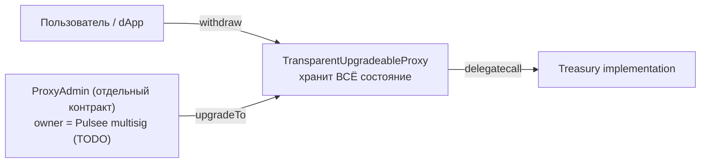

# Pulsee Treasury

Hardhat-проект для смарт-контракта **Treasury** проекта Pulsee. Это **single-token форк** Doppy Treasury: контракт обслуживает **только токен SEE** (без BNH/USDT), плюс выполнено лёгкое переименование части полей состояния.

- ERC20: **только SEE** (у Doppy было `DOPPY`/`BNH`/`USDT`).
- NFT: **отсутствуют** (как и в Doppy).
- Дневной лимит: **10** в 1e18 на единственный токен (стартовое значение, меняется через `setTokenLimit`).

`Treasury` — это вольт-хранилище ERC20, выдающее токены по EIP-712 подписи доверенного `signer` с дневными лимитами на пользователя и опцию (token-индекс). Развёртывается под `TransparentUpgradeableProxy` от OpenZeppelin.

## Diff vs doppy

Чтобы локально воспроизвести сравнение с Doppy Treasury, из корня репозитория:

```bash
diff -u doppy/contracts/Treasury.sol pulsee/contracts/Treasury.sol
```

### Высокоуровнево

В отличие от Doppy, в Pulsee:

1. **Один токен вместо трёх** — `initialize(address _signer, IERC20Upgradeable _see)` (вместо `(_signer, _doppy, _bnh, _usdt)`). В список управляемых ассетов кладётся ровно один элемент — SEE.
2. **Переименованы 4 идентификатора состояния** (и только они):
   - `tokens` → `assets`
   - `maxTokenTransferPerDay` → `dailyCaps`
   - `tokensTransfersPerDay` → `drawnPerDay`
   - `GNOSIS` → `CUSTODY` (по-прежнему `address(0)` — заглушка-предохранитель).
3. **`CUSTODY` — заглушка-предохранитель** — `address(0)` + TODO-комментарий вместо хардкода адреса мультисига.

### Что **не** меняется (байт-в-байт с Doppy)

- Имена публичных функций: `withdraw`, `verifySignature`, `setSigner`, `setTokenLimit`, `addToken`, `disableToken`, `withdrawToken`, `getCurrentDay`.
- События: `Withdrawed`, `SetSigner`, `SetTokenLimit`, `AddToken`, `DisableToken`, `WithdrawToken`.
- EIP-712 домен: `NAME = "TREASURY"`, `EIP712_VERSION = "1"`.
- `PASS_TYPEHASH` — `WithdrawSignature(uint256 nonce,uint256 amount,address address_to,uint256 ttl,uint256 option)`.
- Параметр `_option` в сигнатуре сохранён; для единственного токена SEE валиден **`_option = 0`**.
- `__gap[50]`, параметры компиляции (Solidity 0.8.17, optimizer off, runs = 200).

### Бэкенд-подпись

Поскольку `NAME`, `EIP712_VERSION` и `PASS_TYPEHASH` идентичны Doppy, бэкенд, который подписывает `WithdrawSignature(...)` для Doppy, **может использовать тот же код** для Pulsee — нужно лишь сменить `verifyingContract` на адрес Pulsee-прокси. Коллизий подписей между приложениями не будет: `verifyingContract` (адрес прокси) у каждого свой.

### Про «обфускацию» — честная оговорка

Переименования затрагивают только **имена** полей состояния (и их авто-геттеры в ABI: `assets`, `dailyCaps`, `drawnPerDay`). Поскольку структура (массивы + индекс `_option`) и логика совпадают с Doppy, **байткод остаётся близок к Doppy**. Цель этого форка — чтобы контракт читался как самостоятельный продукт при просмотре исходника человеком; это **не** защита от автоматического сравнения байткода (Etherscan similar-contracts, Forta, аудит). Если такая задача появится — нужно структурное расхождение (например, схлопывание в скалярный токен без массивов и без `_option`).

### Storage layout

Storage layout у Pulsee свой (нет `_bnh`/`_usdt`-элементов в массивах; одиночный SEE). Это значит:

- **Нельзя** взять Pulsee-имплементацию и сделать ею upgrade Doppy/Cheelee-прокси (или наоборот) — `@openzeppelin/hardhat-upgrades` отклонит апгрейд. Это намеренно: независимый контракт со свежим прокси.
- Дальнейшие апгрейды Pulsee должны соблюдать его layout (новые поля только в конец, поверх `__gap`).

## TODO перед первым деплоем

> **Не подставлен адрес владельца Pulsee multisig.**
>
> В [contracts/Treasury.sol](contracts/Treasury.sol) константа `CUSTODY` сейчас равна `address(0)`:
>
> ```solidity
> // TODO(pulsee): replace with the actual Pulsee multisig address before deploying.
> address public constant CUSTODY = address(0);
> ```
>
> Любой деплой с этим значением **гарантированно упадёт** в `initialize` с ошибкой `Ownable: new owner is the zero address`. Это сделано намеренно — предохранитель от случайного выкатывания контракта без владельца. Перед mainnet/testnet деплоем замените на реальный адрес мультисига Pulsee и пересоберите.

## Адреса в BSC

Контракт пока не развёрнут. После первого деплоя адреса прокси / имплементации / `ProxyAdmin` запишутся сюда.

## Как это работает (вкратце)



Состояние (`assets`, `signer`, `drawnPerDay`, `usedSignature`, балансы) лежит в storage прокси. Имплементация хранит только bytecode. `initialize(...)` вызывается один раз через прокси сразу после деплоя; затем `transferOwnership(CUSTODY)` передаёт владение мультисигу.

Подробное объяснение паттерна, дневных лимитов и storage-инвариантов — в README соседнего подпроекта [`../doppy/README.md`](../doppy/README.md). Для Pulsee всё то же самое, но с одним токеном SEE.

## Параметры компиляции

Совпадают с Doppy Treasury:

- Solidity `0.8.17`
- Optimizer **выключен**, `runs = 200`
- EVM version: default

## Зависимости

- `@openzeppelin/contracts-upgradeable@4.7.3` — пин на ту же линию OZ, что использует Doppy/Cheelee Treasury.
- `@openzeppelin/contracts@^4.9.6` — нужен плагину `hardhat-upgrades` для развёртывания `TransparentUpgradeableProxy` и `ProxyAdmin`.
- `@openzeppelin/hardhat-upgrades@^3` + `@nomicfoundation/hardhat-toolbox@^4` + `hardhat@^2.22`.

## Установка и сборка

```bash
cd pulsee
npm install
npx hardhat compile
```

Артефакт появится по пути `artifacts/contracts/Treasury.sol/Treasury.json`.

## Деплой

1. **Сначала** — установить `CUSTODY` в `contracts/Treasury.sol` на адрес Pulsee multisig (см. блок TODO выше).
2. Скопировать `.env.example` в `.env`, заполнить:
   - `PRIVATE_KEY` — деплоер с tBNB / BNB на балансе.
   - `BSC_TESTNET_RPC_URL` / `BSC_RPC_URL` — опционально, иначе используется публичная нода из `hardhat.config.js`.
   - `BSCSCAN_API_KEY` — опционально, нужен только для `hardhat verify`.
   - `SIGNER` — EOA-адрес бэкенда, который подписывает `WithdrawSignature` payload'ы.
   - `SEE` — **прокси-адрес** ERC20-токена SEE.
3. Запустить:

   ```bash
   npm run deploy:bscTestnet   # сначала на тестнет
   npm run deploy:bsc          # потом на mainnet
   ```

   Скрипт `scripts/deploy.js` через `upgrades.deployProxy(...)` за один вызов поднимает Treasury implementation + ProxyAdmin + TransparentUpgradeableProxy и инициализирует прокси.

4. После успешного деплоя в выводе появятся адреса `proxy`, `implementation`, `proxyAdmin`. Передайте `ProxyAdmin.transferOwnership` в Pulsee multisig.

## Структура

```
pulsee/
├── .env.example
├── README.md
├── package.json
├── hardhat.config.js
├── contracts/
│   └── Treasury.sol
└── scripts/
    └── deploy.js
```
